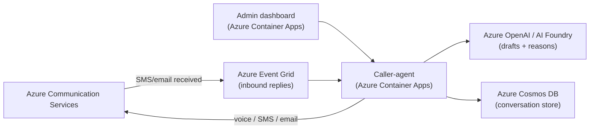

# Contact Center Agent — Voice, SMS & Email with AI on Azure

An AI contact-center agent (voice + SMS + email, driven by Azure OpenAI) on Azure Communication Services, with an admin dashboard. This README doubles as the **Norlys production setup guide**: how to run it in Norlys's own Azure tenant and what changes vs. the Microsoft demo tenant.

> TL;DR — The whole thing is Azure-native (Azure Communication Services + Azure OpenAI). Everything works on a normal Norlys production subscription. The only reason SMS looks limited in the _demo_ is that the demo runs on a locked Microsoft **sandbox** subscription where buying numbers / alphanumeric senders is blocked. On Norlys's tenant those blocks don't exist.

---

## 1. Architecture (100% Azure)



| Capability                        | Azure service                                                 | Notes                                          |
| --------------------------------- | ------------------------------------------------------------- | ---------------------------------------------- |
| AI (message drafting, live voice) | **Azure OpenAI** (via AI Foundry) + Voice Live                | Already used for the voice agent.              |
| Voice calls                       | **ACS Call Automation**                                       | Global reach incl. Danish numbers. Live today. |
| SMS                               | **ACS SMS** (native sender **or** Messaging Connect partner)  | See §3.                                        |
| Email                             | **ACS Email** **or** **Microsoft Graph `sendMail`**           | See §4.                                        |
| Inbound replies                   | **Azure Event Grid** → `/api/events/sms`, `/api/events/email` | Correlated back into the conversation.         |
| Conversation store                | **Azure Cosmos DB** (serverless)                              | Falls back to in-memory if unset.              |
| Hosting                           | **Azure Container Apps**                                      | `azd up` deploys both services.                |

---

## 2. What works today vs. what Norlys must set up

| Channel                   | Demo (MS sandbox)                                                                     | Norlys production tenant                                                   |
| ------------------------- | ------------------------------------------------------------------------------------- | -------------------------------------------------------------------------- |
| **Voice** to +45          | ✅ live                                                                               | ✅ works as-is                                                             |
| **Email** to +45          | ✅ live                                                                               | ✅ works (verify `norlys.dk` domain, or use Graph)                         |
| **SMS send** to +45       | ⚠️ via Infobip trial test sender (`ServiceSMS`), 15 msgs, only to the verified number | ✅ real, branded **"Norlys"** sender after a one-time carrier registration |
| **SMS receive** (replies) | ❌ trial test sender is send-only → use the dashboard _simulate reply_ (§6)           | ✅ real, with a two-way number + Event Grid                                |

**Why the demo is limited:** the sandbox subscription blocks both _buying a number_ and _enabling an alphanumeric sender_. That is a tenant policy on the Microsoft demo sub — **not** an Azure or ACS limitation. Norlys's own EA / Pay-as-you-go subscription has neither block.

---

## 3. SMS in Norlys's tenant — two supported paths

Both use the **standard ACS SMS API** — only the sender differs. Pick one.

### Option A — Native ACS SMS (recommended for a Danish-only rollout)

1. In the Norlys ACS resource → **Phone numbers / Alphanumeric Sender ID**.
2. Register a **Danish alphanumeric sender "Norlys"** (one-way, for notifications/OTP) **or** buy a **Danish mobile/long number** (two-way).
   - Danish sender registration via the carrier takes **a few business days** (regulatory, one-time).
3. Set config on the caller-agent:
   - `AcsSmsNumber` = the DK number (two-way), **or**
   - `Acs:SmsSenderId` = `Norlys` (alphanumeric, one-way).
4. For **inbound replies** (two-way number only): run `scripts/setup-eventgrid.ps1` to subscribe _SMS Received_ → `/api/events/sms`.

### Option B — ACS Messaging Connect (Infobip) — fastest multi-country

Same ACS SDK; ACS routes delivery to Infobip. **No subscription restriction — works on any sub.**

1. Create an **Infobip** account, then in the Azure portal ACS resource open the **Messaging Connect** blade → choose Infobip (or, from Infobip: _Exchange → SMS for Microsoft Azure Communication Services_ → add your ACS **immutable resource ID**).
2. In Infobip, provision the sender (branded **"Norlys"** for Denmark needs Infobip's DK registration, ~6 days; a test sender works instantly for trials).
3. Create an Infobip **API key** with scope `sms:message:send`.
4. Set config on the caller-agent (store the key as a **secret**, never in source):
   - `MessagingConnect__ApiKey` = `<infobip-api-key>` (Container Apps secret)
   - `MessagingConnect__Sender` = `Norlys` (or the synced number / trial test sender)
   - `MessagingConnect__Partner` = `infobip` (default)
5. Send code is unchanged — it's `SmsClient.Send(..., new SmsSendOptions(true){ MessagingConnect = new MessagingConnectOptions(apiKey, "infobip") })`.

> When `MessagingConnect:ApiKey` is set, the caller-agent automatically routes SMS through Messaging Connect; otherwise it uses the native `AcsSmsNumber` / `Acs:SmsSenderId`. No code change needed to switch.

**Pricing:** Microsoft charges a small platform fee per send (~$0.0025); Infobip bills delivery + number lease separately (pay-as-you-go). Native ACS SMS is billed directly by Microsoft.

---

## 4. Email in Norlys's tenant — two supported paths

### Option A — ACS Email (already wired)

1. In the Norlys ACS resource → **Email → Domains**, add and **verify `norlys.dk`** (DNS TXT/DKIM/DMARC records).
2. Set `Email:SenderAddress` = e.g. `noreply@norlys.dk` and `AcsConnectionString`.
3. Inbound email replies require a **custom domain** (already the case with `norlys.dk`) + an Event Grid subscription → `/api/events/email`.

### Option B — Microsoft Graph `sendMail` (great for an M365 shop)

Sends from a **real `norlys.dk` mailbox** via Microsoft Graph — fully branded, and because replies land in that mailbox, **email is two-way without attaching a custom domain to ACS**.

1. Set `Graph:SenderAddress` to the mailbox, e.g. `noreply@norlys.dk`. That alone switches the email channel to Graph.
2. Grant the caller-agent's **managed identity** the Graph application permission **`Mail.Send`** (admin consent).

Auth uses `DefaultAzureCredential` — managed identity in Azure (**no secret**), `az login` locally. Leave `Graph:SenderAddress` empty to stay on ACS Email.

---

## 5. AI

- **Azure OpenAI** (via AI Foundry) drafts SMS/email content and runs the live voice agent. Set `AzureOpenAI:Endpoint`; the model/deployment defaults live in `ContactCenterAgent.Shared/VoiceLive/VoiceLiveDefaults.cs`.
- Optionally add **Azure AI Content Safety** for moderation before send.

---

## 6. Using it from the admin dashboard

The dashboard (Kundesessioner panel) can already:

- **Send** an SMS / email / start a voice call — pick the channel, enter the recipient + message, **Send udgående**.
- **See every conversation** grouped by customer, expand to view the full two-way timeline (Norlys ↔ kunde).

**Simulate a reply (demo aid):** when a live inbound isn't available (e.g. the SMS trial test sender is send-only), expand a customer and use the **"Simulér kundesvar"** box to inject a reply. It flows through the _same_ inbound code path as a real Event Grid reply, so the two-way thread renders exactly as it would in production.

> **Turn this off in production:** set `Outreach:AllowSimulatedReplies=false` on the caller-agent. The endpoint then returns 403 and the dashboard reply box has no effect. In prod, real replies arrive automatically via Event Grid.

---

## 7. Configuration reference (caller-agent)

Nested keys use `:` in appsettings and `__` (double underscore) as environment variables / Container Apps settings. Store all keys/connection strings as **secrets**.

| Key                              | Purpose                                                      |
| -------------------------------- | ------------------------------------------------------------ |
| `AcsConnectionString`            | ACS resource (voice, SMS, email).                            |
| `AcsPhoneNumber`                 | Outbound voice number.                                       |
| `AcsSmsNumber`                   | Native SMS number (two-way).                                 |
| `Acs:SmsSenderId`                | Native alphanumeric sender (one-way).                        |
| `MessagingConnect:ApiKey`        | Infobip API key → enables Messaging Connect SMS. **Secret.** |
| `MessagingConnect:Sender`        | MC sender (e.g. `Norlys` / synced number / test sender).     |
| `MessagingConnect:Partner`       | Partner id, default `infobip`.                               |
| `Email:SenderAddress`            | ACS Email from-address (e.g. `noreply@norlys.dk`).           |
| `Graph:SenderAddress`            | Mailbox for Graph `sendMail`. Set = Graph (two-way email); empty = ACS Email. |
| `AzureOpenAI:Endpoint`           | Azure OpenAI endpoint. Also drafts SMS/email bodies from an intent. |
| `Cosmos:Endpoint`                | Cosmos DB (conversation store); in-memory fallback if unset. |
| `Outreach:AllowSimulatedReplies` | Set `false` in prod to disable the demo reply injector.      |

Set a secret example (Container Apps):

```powershell
az containerapp secret set -n ca-caller-agent -g <rg> --secrets infobip-key=<KEY>
az containerapp update  -n ca-caller-agent -g <rg> \
  --set-env-vars MessagingConnect__ApiKey=secretref:infobip-key MessagingConnect__Sender=Norlys
```

> Env vars set via `az containerapp update` are overwritten by the next Bicep deploy — for a permanent setting add the value to `infra/resources.bicep` (a `@secure()` param fed from an azd env var).

---

## 8. Deploy

```powershell
azd up                     # provision + deploy both services
azd deploy caller-agent    # phone/SMS/email service only
azd deploy admin-chat      # dashboard only
```

### Danish numbers end-to-end (`azd up` buys them)

`azd up` provisions the phone numbers for you — set the country first:

```powershell
azd env set PHONE_COUNTRY DK
azd up
```

- **`postprovision`** buys a DK **geographic** number (voice → `AcsPhoneNumber`) **and** a DK **mobile** number with `inbound+outbound` SMS (**two-way** → `AcsSmsNumber`). Denmark has no single number that does both, so two are bought. The SMS purchase is best-effort and never blocks voice.
- **`postdeploy`** runs `setup-eventgrid.ps1`, which subscribes **`Microsoft.Communication.IncomingCall`** → `/api/incomingCall` **and** **`Microsoft.Communication.SMSReceived`** → `/api/events/sms`, so **inbound replies work automatically**.

The one step that can't be scripted: Danish mobile numbers need **carrier/regulatory registration**, and SMS delivery only starts once approved (~1–3 weeks). Voice is immediate.

---

## 9. Norlys production checklist

- [ ] Deploy to a Norlys **EA / Pay-as-you-go** subscription (not a sandbox).
- [ ] `azd env set PHONE_COUNTRY DK` → `azd up` buys the DK voice + **two-way SMS** numbers.
- [ ] Complete the DK mobile number's carrier registration (SMS delivery starts after approval).
- [ ] Email: verify **`norlys.dk`** in ACS Email (or wire Graph `sendMail`).
- [ ] Inbound: confirm the Event Grid subscriptions exist (`scripts/setup-eventgrid.ps1`).
- [ ] Leave `MessagingConnect:*` empty to use **native ACS** instead of the partner route.
- [ ] Set `Outreach:AllowSimulatedReplies=false`.
- [ ] Store all keys as secrets; add them to Bicep so deploys don't wipe them.
- [ ] Confirm Azure OpenAI capacity/region for the chosen models.

---

## 10. PoC requirements → implementation

| Requirement                                            | Where it lives                                                                                                                                                                            |
| ------------------------------------------------------ | ----------------------------------------------------------------------------------------------------------------------------------------------------------------------------------------- |
| Callable **REST endpoint**                             | `POST /api/outreach`, `GET /api/outreach/{id}`, `GET /api/channels`, `GET /api/customers`                                                                                                 |
| **MCP server** for other AI agents                     | `/mcp` (anonymous, Streamable HTTP) — `start_outreach`, `get_outreach_result`, `list_channels`                                                                                            |
| Input: customer, channel, message/intent **+ context** | `OutreachRequest` (REST) and the `context` parameter on `start_outreach` (MCP)                                                                                                            |
| **Structured output** back to the calling agent        | `OutreachResult` — reply, collected, metrics, summary, outcome, topics, full interaction timeline                                                                                         |
| **Async / callback** for slow channels                 | `callbackUrl` (pushed on completion) + `awaiting_reply` status for polling                                                                                                                |
| **Voice** (HD voices, personas)                        | ACS Call Automation + Voice Live; personas in `personas.json`                                                                                                                             |
| **SMS** outbound + inbound replies                     | ACS SMS; inbound via Event Grid → `/api/events/sms`                                                                                                                                       |
| **Email** outbound + inbound replies                   | ACS Email (inbound via Event Grid → `/api/events/email`, needs a custom domain) **or** Microsoft Graph `sendMail` from a real mailbox — replies land in that mailbox, so two-way needs no ACS domain |
| Message body from **intent + system prompt**           | With no literal `message`, Azure OpenAI drafts the SMS/email body from the intent, the persona system prompt (`personas.json`) and the supplied `context`                                  |
| Metrics: **sentiment (satisfaction, problem-solved)**  | `OutreachResult.Metrics` — `satisfaction`, `problem_solved`, `overall_sentiment`, `customer_mood`, `frustration`, `churn_risk`, `trust_in_agent`, `call_effectiveness` (0–6, 3 = neutral) |
| Extensible LLM structured output                       | `Metrics` / `Collected` are open key-value maps; `ConversationAnalysisService` owns the schema                                                                                            |
| **Portable / config-driven**                           | All channel wiring is config (see §7); no code change to move to Norlys's Azure                                                                                                           |

---

## References

- ACS SMS: https://learn.microsoft.com/azure/communication-services/concepts/sms/concepts
- Messaging Connect: https://learn.microsoft.com/azure/communication-services/concepts/sms/messaging-connect
- ACS Email: https://learn.microsoft.com/azure/communication-services/concepts/email/email-overview
- Graph sendMail: https://learn.microsoft.com/graph/api/user-sendmail
- Azure OpenAI: https://learn.microsoft.com/azure/ai-services/openai/overview
