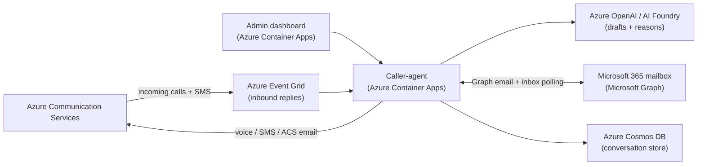

# Contact Center Agent — Voice, SMS & Email with AI on Azure

An AI contact-center agent (voice + SMS + email, driven by Azure OpenAI) on Azure Communication Services, with an admin dashboard. This README doubles as the **Norlys production setup guide**: how to run it in Norlys's own Azure tenant and what changes vs. the Microsoft demo tenant.

> TL;DR — The solution is Azure-native (Azure Communication Services, Azure OpenAI, Cosmos DB and Microsoft Graph). It is designed for a normal Norlys production subscription, subject to tenant policy, model quota and carrier eligibility. The demo's SMS limitation comes from its locked Microsoft **sandbox** subscription; confirm the corresponding permissions and eligibility in the Norlys tenant before rollout.

> **Production gate:** `azd up` deploys the working PoC with public, anonymous app ingress. Do not treat that deployment as production-secure until the authentication, authorization, callback allow-listing and demo-feature shutdown items in §10 are complete.

---

## What your AI agent gets

Your onboarding agent hands a customer conversation to this service and gets the answer back.
It calls one tool with **who** to contact, **which channel**, and **what you need to know**. The
service places the phone call, sends the SMS or writes the email, talks to the customer, and hands
back a structured result: what the customer said, the fields collected, a summary and sentiment
scores. Your agent never touches Azure Communication Services directly.

**One endpoint, no SDK:**

```text
https://<caller-agent-host>/mcp
```

Standard MCP over Streamable HTTP, so any MCP-capable agent (Copilot Studio, VS Code, LangChain,
your own orchestrator) can connect. Everything is also available as plain REST — same engine behind
both, so behaviour is identical.

### The 10 tools

| Tool                       | What it does                                                                                  |
| -------------------------- | --------------------------------------------------------------------------------------------- |
| `start_outreach`           | **The main one.** Call, text or email a customer. Returns an `outreachId` immediately.        |
| `wait_for_outreach_result` | Block until the customer has responded, then return the full structured result.               |
| `get_outreach_result`      | Check status and result at any time, without blocking.                                        |
| `send_followup`            | Continue an existing conversation — e.g. a written recap after a call.                        |
| `list_channels`            | Which of voice / SMS / email can actually reach this customer right now.                      |
| `list_personas`            | Which business scenarios the agent can run (onboarding, billing, …) and the tone it will use. |
| `list_customers`           | Everyone contacted so far, with channels used and last outcome.                               |
| `get_customer_timeline`    | One customer's full history across calls, SMS and email.                                      |
| `list_outreach`            | Recent outreaches across all customers — check before starting something new.                 |
| `retry_callback`           | Re-send a result push that failed, after you have fixed the receiving endpoint.               |

Every tool publishes an `outputSchema` and returns its result as MCP `structuredContent`, so your
agent gets a typed contract instead of text to parse.

Tools are also annotated so a client can tell them apart before calling: the six `list_*` /
`get_*` / `wait_*` tools are marked **read-only** and are safe to call freely, while
`start_outreach` and `send_followup` are marked **destructive** because they actually contact a
customer. Orchestrators that honour MCP annotations can require human confirmation on those two —
worth using for a live consumer-facing rollout.

### How it meets the PoC requirements

| Your requirement                                   | How it works                                                                                                                                                                                                                                                          |
| -------------------------------------------------- | --------------------------------------------------------------------------------------------------------------------------------------------------------------------------------------------------------------------------------------------------------------------- |
| Callable REST **and/or** MCP                       | Both, same engine behind each.                                                                                                                                                                                                                                        |
| Input: customer, channel, message/intent + context | One `start_outreach` call. Give an `intent` and the AI writes the message, or supply exact wording yourself.                                                                                                                                                          |
| Structured output back to the calling agent        | Every call returns `OutreachResult` — reply, collected fields, summary, outcome, topics, metrics, full timeline. Delivered as MCP `structuredContent` against a published `outputSchema`, so your agent gets a typed, validatable contract rather than text to parse. |
| Async / callback for slow channels                 | Choose one: `wait_for_outreach_result` (blocks), poll `get_outreach_result`, or give a `callbackUrl` to be pushed.                                                                                                                                                    |
| One service across voice, SMS, email               | Same tool for all three. `channel: "auto"` lets the service pick based on what you know about the customer.                                                                                                                                                           |
| Sentiment + extensible LLM output                  | Satisfaction, problem-solved, sentiment, frustration, churn risk on every channel. Scores are 0–6, 3 = neutral.                                                                                                                                                       |
| Portable to Norlys's Azure                         | All channel wiring is configuration (§7); one `azd up` deploys the whole thing to any subscription.                                                                                                                                                                   |

### A typical run

```text
1. list_channels            → can we reach this customer on SMS at all?
2. start_outreach           → place the call / send the message, get an outreachId
3. wait_for_outreach_result → block until the customer responds (or supply a callbackUrl)
4. read reply, collected, summary, metrics → hand back to your onboarding agent
```

A prompt an MCP-capable agent can act on directly:

```text
Call Mette Jensen on +4512345678 with the billing persona and ask her to confirm the
service address for case N-1042. Wait up to five minutes, then give me the outcome,
what she confirmed, and her satisfaction score.
```

**Channels vs personas** — the two are independent and combine freely:

- A **channel** is _how_ you reach someone (voice / SMS / email). Availability is set by configuration and telecom regulation, so it changes per environment.
- A **persona** is _who the agent is being_ and what it is trying to achieve (onboarding, billing). It is a prompt in `personas.json`, applies to all three channels, and your CX team can add one without any Azure or carrier change.

Full technical reference — connection config, every input, the result schema, the REST routes and
the reliability guarantees — is in §8.

---

## 1. Architecture (100% Azure)



| Capability                        | Azure service                                                           | Notes                                          |
| --------------------------------- | ----------------------------------------------------------------------- | ---------------------------------------------- |
| AI (message drafting, live voice) | **Azure OpenAI** (via AI Foundry) + Voice Live                          | Already used for the voice agent.              |
| Voice calls                       | **ACS Call Automation**                                                 | Global reach incl. Danish numbers. Live today. |
| SMS                               | **ACS SMS** (native sender **or** Messaging Connect partner)            | See §3.                                        |
| Email                             | **ACS Email** **or** **Microsoft Graph `sendMail`**                     | See §4.                                        |
| Inbound replies                   | **SMS:** Event Grid → `/api/events/sms`; **email:** Graph inbox polling | Correlated back into the conversation.         |
| Conversation store                | **Azure Cosmos DB** (serverless)                                        | Falls back to in-memory if unset.              |
| Hosting                           | **Azure Container Apps**                                                | `azd up` deploys both services.                |

---

## 2. What works today vs. what Norlys must set up

| Channel                   | Demo (MS sandbox)                                                                     | Norlys production tenant                                                   |
| ------------------------- | ------------------------------------------------------------------------------------- | -------------------------------------------------------------------------- |
| **Voice** to +45          | ✅ live                                                                               | ✅ works as-is                                                             |
| **Email** to +45          | ✅ live                                                                               | ✅ works (verify `norlys.dk` domain, or use Graph)                         |
| **SMS send** to +45       | ⚠️ via Infobip trial test sender (`ServiceSMS`), 15 msgs, only to the verified number | ✅ real, branded **"Norlys"** sender after a one-time carrier registration |
| **SMS receive** (replies) | ❌ trial test sender is send-only → use the dashboard _simulate reply_ (§6)           | ✅ real, with a two-way number + Event Grid                                |

**Why the demo is limited:** the sandbox subscription blocks both _buying a number_ and _enabling an alphanumeric sender_. That is **subscription eligibility** on the Microsoft demo sub — **not** a product limitation. Danish mobile numbers with two-way SMS are **generally available** in ACS (see §3). A Norlys EA / Pay-as-you-go subscription with a Danish billing address is the intended target.

---

## 3. SMS in Norlys's tenant — two supported paths

Both use the **standard ACS SMS API** — only the sender differs. Pick one.

### Option A — Native ACS SMS (recommended — this is the GA path)

**Denmark capability matrix** ([official source](https://learn.microsoft.com/en-us/azure/communication-services/concepts/numbers/phone-number-management-for-denmark) — re-read it before quoting, it changes):

| DK number type         | Send SMS | Receive SMS | Make calls | Receive calls |
| ---------------------- | -------- | ----------- | ---------- | ------------- |
| Toll-Free              | –        | –           | GA         | GA            |
| Local (geographic)     | –        | –           | GA         | GA            |
| **Mobile**             | **GA**   | **GA**      | –          | –             |
| Alphanumeric Sender ID | GA       | –           | –          | –             |

> **The #1 trap:** Danish toll-free and local numbers are **voice-only**. Only the `Mobile` type carries SMS in Denmark. Searching toll-free/local, seeing no SMS option and concluding "Azure can't do SMS in Denmark" is the most common wrong turn.

**Eligibility gates** — all three must pass, or the number type is simply hidden from search:

- **Agreement type:** Modern Customer Agreement (Field/Customer Led), Modern Partner Agreement (CSP), Enterprise Agreement, or Pay-As-You-Go. Anything else is case-by-case via a ticket at <https://pstnsd.powerappsportals.com/>.
- **Billing location** (two different allow-lists — don't conflate them):
  - DK numbers generally: AU, CA, DK, FR, DE, IE, IT, JP, NL, ES, SE, UK, US
  - **DK mobile (narrower):** AU, BE, DK, FI, IE, LV, NL, PL, SE, UK, US → DE/FR/IT/ES/CA/JP can buy a DK toll-free but **not** a DK mobile.
  - DK alphanumeric sender ID: AU, AT, DK, FR, DE, IN, IE, IT, NL, PL, PT, PR, ES, SE, CH, UK, US
- **Payment:** Azure Prepayment (Monetary Commitment) funds and prepaid credits **cannot** buy numbers.

**Steps:**

1. In the Norlys ACS resource → **Phone numbers / Alphanumeric Sender ID**.
2. Buy a **Danish mobile number** (two-way SMS) **or** register a **Danish alphanumeric sender "Norlys"** (one-way, for notifications/OTP).
   - Danish sender registration via the carrier takes **a few business days** (regulatory, one-time).
3. Set config on the caller-agent:
   - `AcsSmsNumber` = the DK number (two-way), **or**
   - `Acs:SmsSenderId` = `Norlys` (alphanumeric, one-way).
4. For **inbound replies** (two-way number only): run `scripts/setup-eventgrid.ps1` to subscribe _SMS Received_ → `/api/events/sms`.

### Option B — ACS Messaging Connect (Infobip) — multi-country fallback

Same ACS SDK; ACS routes delivery to Infobip. **No subscription restriction — works on any sub.** Use this when Option A is blocked (ineligible agreement/billing location) or when you need countries ACS doesn't serve natively.

> **Public preview:** no SLA, and Microsoft's guidance is not to use it for production workloads. .NET and JavaScript SDKs only — Python and Java are "coming soon". Its _Dynamic_ Alphanumeric Sender ID is offered only in countries ACS doesn't natively support, so for Denmark the MC options are a long code (VLN) or a partner-managed pre-registered alpha.

1. Create an **Infobip** account, then in the Azure portal ACS resource open the **Messaging Connect** blade → choose Infobip (or, from Infobip: _Exchange → SMS for Microsoft Azure Communication Services_ → add your ACS **immutable resource ID**).
2. In Infobip, provision the sender (branded **"Norlys"** for Denmark needs Infobip's DK registration, ~6 days; a test sender works instantly for trials).
3. Create an Infobip **API key** with scope `sms:message:send`.
4. Set config on the caller-agent (store the key as a **secret**, never in source):
   - `MessagingConnect__ApiKey` = `<infobip-api-key>` (Container Apps secret)
   - `MessagingConnect__Sender` = `Norlys` (or the synced number / trial test sender)
   - `MessagingConnect__Partner` = `infobip` (default)
5. Send code is unchanged — it's `SmsClient.Send(..., new SmsSendOptions(true){ MessagingConnect = new MessagingConnectOptions(apiKey, "infobip") })`.

> When `MessagingConnect:ApiKey` is set, the caller-agent automatically routes SMS through Messaging Connect; otherwise it uses the native `AcsSmsNumber` / `Acs:SmsSenderId`. No code change needed to switch.

**Pricing:** Microsoft charges a small platform fee per send (~$0.0025); Infobip bills delivery + number lease separately (pay-as-you-go). Native ACS SMS is billed directly by Microsoft.

---

## 4. Email in Norlys's tenant — three supported modes

### Option A — ACS Email (already wired, outbound-only)

1. In the Norlys ACS resource → **Email → Domains**, add and **verify `norlys.dk`** (DNS TXT/DKIM/DMARC records).
2. Set `Email:SenderAddress` = e.g. `noreply@norlys.dk` and `AcsConnectionString`.

ACS Email does **not** receive customer email replies. Its Event Grid integration emits delivery
and engagement reports only; verifying `norlys.dk` authenticates outbound sending but does not
create an inbox. Use Option B or C when replies must appear in the customer timeline.

### Option B — Microsoft Graph (real mailbox, **two-way out of the box**)

Sends from a **real `norlys.dk` mailbox** via Graph `sendMail`, and a background poller
(`GraphInboxPoller`) reads replies from that same mailbox — so **email is two-way without
attaching a custom domain to ACS**. Replies flow into the _same_ `HandleInboundEmailAsync`
path as ACS Event Grid, landing in the customer's cross-channel timeline.

```powershell
# 1. Grant the caller-agent's managed identity Mail.Send + Mail.ReadWrite (needs a tenant admin)
./scripts/grant-graph-mail-permissions.ps1

# 2. Point the service at the mailbox and roll it out
azd env set GRAPH_SENDER_ADDRESS noreply@norlys.dk
azd provision
azd deploy caller-agent
```

Auth is `DefaultAzureCredential` — **managed identity in Azure (no secret)**, `az login` locally.
Leave `GRAPH_SENDER_ADDRESS` empty to stay on ACS Email. Poll interval defaults to 30s
(`Graph:PollSeconds`); replies are de-duplicated by reading only unread mail and marking it read.

> **Production hardening:** `Mail.Send` / `Mail.ReadWrite` are tenant-wide application permissions.
> Scope them to the single outreach mailbox with an Exchange
> [application access policy](https://learn.microsoft.com/graph/auth-limit-mailbox-access).

### Option C — ACS delivery + mailbox replies (best of both)

`PREFER_ACS_EMAIL_DELIVERY=true` sends through **ACS Email** while setting **Reply-To** to the
Graph mailbox, so `GraphInboxPoller` still captures replies. Use this when the sending tenant
can't deliver externally, or whenever a **real delivery status** matters.

Why it exists (verified 2026-07-30): Graph `sendMail` is **fire-and-forget** — it returns `202`
even when Exchange later drops the message, so a blocked tenant looks identical to a working one.
Trial / sandbox / CAP tenants are commonly barred from outbound internet mail: on this demo tenant,
Graph mail to `@gmail.com` and `@microsoft.com` was accepted and **never delivered**, while ACS
Email to the same addresses reported `status: Succeeded` and arrived. ACS Email polls to a true
delivery status; Graph cannot.

```powershell
azd env set PREFER_ACS_EMAIL_DELIVERY true
azd provision; azd deploy caller-agent
```

Sender note: the Azure **managed** domain is documented as `DoNotReply`-only, but a custom
local-part is accepted in practice — the Bicep provisions **`kundeservice@<managed-domain>`**
(display name "Norlys Kundeservice"), which reads far better than "donotreply" to a customer.
On a **verified custom domain** (`norlys.dk`) none of this applies: Option B delivers externally
on its own, and Option A gets Event Grid inbound.

---

## 5. AI

- **Azure OpenAI** (via AI Foundry) drafts SMS/email content and runs the live voice agent. Set `AzureOpenAI:Endpoint`; the model/deployment defaults live in `ContactCenterAgent.Shared/VoiceLive/VoiceLiveDefaults.cs`.
- Optionally add **Azure AI Content Safety** for moderation before send.

---

## 6. Using it from the admin dashboard

The dashboard (Kundesessioner panel) can already:

- **Send** an SMS / email / start a voice call — pick the channel, enter the recipient + message, **Send udgående**.
- **See every conversation** grouped by customer, expand to view the full two-way timeline (Norlys ↔ kunde).

**Simulate a reply (demo aid):** when a live inbound isn't available (e.g. the SMS trial test sender is send-only), expand a customer and use the **"Simulér kundesvar"** box to inject a reply. It flows through the _same_ inbound code path as a real Event Grid reply, so the two-way thread renders exactly as it would in production.

> **Turn this off in production:** set `Outreach:AllowSimulatedReplies=false` on the caller-agent. The endpoint then returns 403 and the dashboard reply box has no effect. In prod, real replies arrive automatically via Event Grid.

---

## 7. Configuration reference (caller-agent)

Nested keys use `:` in appsettings and `__` (double underscore) as environment variables / Container Apps settings. Store all keys/connection strings as **secrets**.

| Key                                                                 | Purpose                                                                                                                                        |
| ------------------------------------------------------------------- | ---------------------------------------------------------------------------------------------------------------------------------------------- |
| `AcsConnectionString`                                               | ACS resource (voice, SMS, email). **Secret.**                                                                                                  |
| `AcsPhoneNumber`                                                    | Outbound voice number.                                                                                                                         |
| `AcsSmsNumber`                                                      | Native SMS number (two-way).                                                                                                                   |
| `Acs:SmsSenderId`                                                   | Native alphanumeric sender (one-way).                                                                                                          |
| `Sms:ConnectionString`                                              | Optional dedicated ACS resource for SMS. Overrides the SMS client created from `AcsConnectionString`. **Secret.**                              |
| `MessagingConnect:ApiKey`                                           | Infobip API key → enables Messaging Connect SMS. **Secret.**                                                                                   |
| `MessagingConnect:Sender`                                           | MC sender (e.g. `Norlys` / synced number / test sender).                                                                                       |
| `MessagingConnect:Partner`                                          | Partner id, default `infobip`.                                                                                                                 |
| `Email:SenderAddress`                                               | ACS Email from-address (e.g. `noreply@norlys.dk`).                                                                                             |
| `Graph:SenderAddress`                                               | Mailbox for Graph `sendMail`. Set = Graph (two-way email); empty = ACS Email.                                                                  |
| `Graph:PollSeconds`                                                 | Inbox poll interval for email replies (default 30, min 10).                                                                                    |
| `Graph:ReplyLookbackDays`                                           | How far back unread mail is scanned, so replies that arrive while the app is down are still captured (default 30, max 90).                     |
| `Email:PreferAcsDelivery`                                           | Send via ACS Email (real delivery status) with the Graph mailbox as Reply-To. Use when the tenant can't send externally.                       |
| `AzureOpenAI:Endpoint`                                              | Azure OpenAI endpoint used by live voice and SMS/email drafting.                                                                               |
| `AzureOpenAI:DeploymentName`                                        | Voice Live model deployment override.                                                                                                          |
| `AzureOpenAI:AnalysisDeploymentName`                                | Drafting and conversation-analysis model deployment override.                                                                                  |
| `AzureOpenAI:ByomProfile`                                           | Voice Live BYOM profile; deployment Bicep currently supplies it.                                                                               |
| `Cosmos:Endpoint`                                                   | Cosmos DB (conversation store); in-memory fallback if unset.                                                                                   |
| `Cosmos:Database` / `Cosmos:Container`                              | Persistence names; both default to `outreach`.                                                                                                 |
| `Voice:Name` / `Voice:Temperature` / `Voice:Style` / `Voice:Locale` | Optional production voice overrides; shared defaults apply when omitted.                                                                       |
| `Outreach:AutoReply`                                                | Let the AI answer inbound written replies (default `true`).                                                                                    |
| `Outreach:EmailSubjectTag`                                          | Stamp a short case reference into email subjects so replies thread onto the right case (default `true`).                                       |
| `Outreach:CallbackAllowedHosts`                                     | Allow-list of callback hosts (`norlys.dk`, `*.norlys.dk`). Empty = any public HTTPS host. Set this in production.                              |
| `Outreach:AllowPrivateCallbackTargets`                              | Permit callbacks to private/loopback addresses. Keep `false` outside local development.                                                        |
| `Outreach:CallbackMaxAttempts`                                      | Delivery attempts before a callback is dead-lettered (default 8, max 20).                                                                      |
| `Outreach:CallbackDispatchSeconds`                                  | Retry sweep interval; a newly queued callback is sent immediately (default 10).                                                                |
| `RESOURCE_NAME_SUFFIX`                                              | Suffix for globally-unique names. Empty = derived from the subscription id (lets any subscription deploy). `none` = original unsuffixed names. |
| `ACS_DATA_LOCATION`                                                 | ACS data residency, e.g. `Europe` for EU phone numbers. Default `United States`.                                                               |
| `Outreach:AllowSimulatedReplies`                                    | Set `false` in prod to disable the demo reply injector.                                                                                        |
| `Outreach:AllowDataReset`                                           | Set `false` in prod to disable `DELETE /api/outreach`.                                                                                         |

Set a secret example (Container Apps):

```powershell
az containerapp secret set -n ca-caller-agent -g <rg> --secrets infobip-key=<KEY>
az containerapp update  -n ca-caller-agent -g <rg> \
  --set-env-vars MessagingConnect__ApiKey=secretref:infobip-key MessagingConnect__Sender=Norlys
```

> Env vars set via `az containerapp update` are overwritten by the next Bicep deploy — for a permanent setting add the value to `infra/resources.bicep` (a `@secure()` param fed from an azd env var).

---

## 8. MCP and REST reference

The plain-language overview and the tool list are at the top of this README. This section is the
detail: how to connect, every input, the result schema, the REST equivalents and what the service
guarantees.

### Connect from VS Code

The repository already contains `.vscode/mcp.json` pointed at the Microsoft demo. Replace that URL
with the Norlys deployment endpoint (or add it to your user-level MCP configuration):

```json
{
  "servers": {
    "norlys-outreach": {
      "type": "http",
      "url": "https://<caller-agent-host>/mcp"
    }
  }
}
```

For local development, use `http://localhost:5000/mcp` after starting the caller-agent.

### Available tools

| Tool                       | Inputs                                                                                                                                                        | Returns / use                                                                                                                                                                                                                                                                              |
| -------------------------- | ------------------------------------------------------------------------------------------------------------------------------------------------------------- | ------------------------------------------------------------------------------------------------------------------------------------------------------------------------------------------------------------------------------------------------------------------------------------------ |
| `list_channels`            | None                                                                                                                                                          | Current voice, SMS and email availability, sender, inbound/outbound support and reach constraints. Call this before selecting a channel.                                                                                                                                                   |
| `list_personas`            | None                                                                                                                                                          | The business scenarios the agent can run (e.g. onboarding, billing), with id, label, description and locale from `personas.json`. A persona sets the agent's role and tone on **every** channel — the voice script and the wording of drafted SMS and email.                               |
| `start_outreach`           | Required: `channel`. Optional: `name`, `phone`, `email`, `intent`, `message`, `customerId`, `callbackUrl`, `context`, `persona`, `locale`, `clientRequestId`. | Starts `voice`, `sms`, `email` or `auto` outreach and immediately returns an `OutreachResult` containing the `outreachId`. For SMS/email, omit `message` to have Azure OpenAI draft it from `intent`, persona and `context`. Pass `clientRequestId` so a retry never places a second call. |
| `get_outreach_result`      | `outreachId`                                                                                                                                                  | Current status and structured result, including reply, collected fields, summary, outcome, topics, metrics and full interaction timeline.                                                                                                                                                  |
| `wait_for_outreach_result` | `outreachId`; optional `timeoutSeconds` (5–600, default 120).                                                                                                 | Waits for `completed`, `failed` or `no_answer`; returns the latest state on timeout. Prefer this over a polling loop when the calling agent can wait.                                                                                                                                      |
| `send_followup`            | `outreachId`, `message`; optional `channel` (`sms` or `email`), `subject` and `clientRequestId`.                                                              | Continues an existing thread. With no override it reuses the channel; a voice thread falls back to SMS, then email.                                                                                                                                                                        |
| `retry_callback`           | `outreachId`                                                                                                                                                  | Re-queues a failed or dead-lettered callback, validates the target again and returns the updated result. Use it after fixing the receiving endpoint.                                                                                                                                       |
| `list_outreach`            | Optional `limit` (1–200, default 50).                                                                                                                         | Recent outreach records across customers and channels, newest first.                                                                                                                                                                                                                       |
| `list_customers`           | None                                                                                                                                                          | Customer rollups with channel history, outreach count, last activity and outcome.                                                                                                                                                                                                          |
| `get_customer_timeline`    | `customerId` from `list_customers`.                                                                                                                           | Complete voice, SMS and email history for one customer in chronological context.                                                                                                                                                                                                           |

`start_outreach`, `get_outreach_result`, `wait_for_outreach_result`, `send_followup` and
`retry_callback` return this structured result shape:

| Field                                     | Meaning                                                                                                                                             |
| ----------------------------------------- | --------------------------------------------------------------------------------------------------------------------------------------------------- |
| `outreachId`                              | Stable id used by all follow-up/result tools.                                                                                                       |
| `status`                                  | `pending`, `awaiting_reply`, `completed`, `failed` or `no_answer`.                                                                                  |
| `channel` / `customerId` / `customerName` | Selected channel and customer identity.                                                                                                             |
| `reply`                                   | Latest customer reply, when one has arrived.                                                                                                        |
| `collected`                               | Open key/value fields extracted during the conversation.                                                                                            |
| `metrics`                                 | Analysis values such as satisfaction, problem solved, sentiment, frustration and churn risk. Scores use 0–6; 3 is neutral.                          |
| `summary` / `outcome` / `topics`          | AI-produced case analysis. Voice uses the call summary; SMS/email are analysed when the thread closes.                                              |
| `callback`                                | Delivery state of `callbackUrl`: `not_requested`, `waiting`, `pending`, `delivered` or `dead_lettered`, with attempts, next attempt and last error. |
| `interactions`                            | Full ordered cross-channel timeline with direction, text and UTC timestamp.                                                                         |
| `createdUtc` / `updatedUtc`               | Lifecycle timestamps.                                                                                                                               |

### Equivalent REST API

The same service is available without MCP. All routes are on the caller-agent host:

| Method and route                           | Purpose                                                                                |
| ------------------------------------------ | -------------------------------------------------------------------------------------- |
| `POST /api/outreach`                       | Start outreach from an `OutreachRequest`.                                              |
| `GET /api/outreach?limit=50`               | List recent outreach records.                                                          |
| `GET /api/outreach/{id}`                   | Get one structured result.                                                             |
| `POST /api/outreach/{id}/followup`         | Continue a thread with `message`, optional `channel`, `subject` and `clientRequestId`. |
| `POST /api/outreach/{id}/callback/retry`   | Re-queue a failed or dead-lettered callback.                                           |
| `GET /api/channels`                        | List configured channel capabilities.                                                  |
| `GET /api/personas`                        | List personas (business scenarios and tone).                                           |
| `GET /api/customers`                       | List customer rollups.                                                                 |
| `GET /api/customers/{customerId}/timeline` | Get one customer's cross-channel history. URL-encode `customerId`.                     |
| `POST /api/outreach/simulate-reply`        | Demo-only reply injection; disable in production.                                      |
| `DELETE /api/outreach`                     | Demo-only deletion of every outreach record; disable in production.                    |

Example:

```http
POST /api/outreach
Content-Type: application/json

{
   "customer": {
      "id": "customer-1042",
      "name": "Mette Jensen",
      "phone": "+4512345678",
      "email": "mette@example.dk"
   },
   "channel": "auto",
   "intent": "Verify the service address before case N-1042 is processed",
   "context": {
      "caseId": "N-1042",
      "accountNumber": "A-8821"
   },
   "callbackUrl": "https://<approved-callback-host>/outreach-result",
   "locale": "da-DK"
}
```

The response is the same `OutreachResult` described above. `POST /api/events/sms` and
`POST /api/incomingCall` are Event Grid webhooks, not client APIs. `/api/events/email` is a
reserved generic webhook; ACS Email has no inbound-message event, so the implemented production
reply path is `GraphInboxPoller`.

### Reliability contract

What a calling agent can rely on, and what it still has to handle itself:

- **Retries are safe.** Pass a stable `clientRequestId` on `start_outreach` and `send_followup`. A repeat with the same id returns the original outreach instead of calling or messaging the customer twice. Reusing an id for a materially different request is rejected (`409` on REST).
- **Callbacks are persisted and retried.** A terminal outreach queues its callback, which is retried with exponential backoff up to `Outreach:CallbackMaxAttempts` and survives a restart. A callback that never succeeds ends as `dead_lettered` and can be replayed with `retry_callback`.
- **Callback targets are validated.** Only absolute HTTPS URLs are called, redirects are not followed, and hosts resolving to private, loopback or link-local addresses are refused. Restrict them further with `Outreach:CallbackAllowedHosts`.
- **Inbound replies are de-duplicated.** A redelivered Event Grid event or a re-read mailbox message is recorded once and never triggers a second AI reply.
- **Email threads onto the right case.** Outbound subjects carry a short case reference, and the Graph conversation id is stored on first reply, so a customer with several open cases is matched correctly. Quoted mail history is stripped before the AI reads the reply.
- **SMS cannot be thread-matched.** Carriers deliver no thread identifier, so an inbound SMS attaches to that number's most recent open outreach. Avoid running two concurrent SMS cases for one number.
- **Written channels return metrics too.** When an SMS or email thread closes it is analysed for summary, outcome, topics, collected fields and sentiment, matching what a voice call returns.

Behaviour is covered by `code/caller-agent/tests/CallerAgent.Tests`:

```powershell
dotnet test code/caller-agent/tests/CallerAgent.Tests/CallerAgent.Tests.csproj
```

### Recommended agent flow

1. Call `list_channels`; for voice, also call `list_personas`.
2. Call `list_customers` / `get_customer_timeline` when prior contact should inform the new outreach.
3. Call `start_outreach` with a stable `customerId`, a `clientRequestId` for retry safety, and business identifiers in `context`.
4. Keep the returned `outreachId`. Call `wait_for_outreach_result`, poll `get_outreach_result`, or provide a trusted `callbackUrl`.
5. Use `send_followup` for a written recap or continued conversation instead of creating a disconnected record.
6. If a callback never arrives, check `callback.status` on the result and re-queue it with `retry_callback`.

Example request for an MCP-capable agent:

```text
Check available channels, then call Mette Jensen on +4512345678 using the
customer-service persona. Ask her to verify the service address for case N-1042.
Wait up to five minutes for the result and return the outcome, collected fields,
summary and satisfaction metrics. Do not start another outreach if one already
exists for this case.
```

> **Security:** the PoC accepts anonymous MCP and REST calls, and `callbackUrl` causes a server-side
> POST. Before production, require authentication/authorization at APIM, restrict callback targets
> to approved HTTPS hosts, add rate limits, and disable simulated replies and data reset with
> `Outreach:AllowSimulatedReplies=false` and `Outreach:AllowDataReset=false`.

---

## 9. Deploy

Prerequisites: `azd` ≥ 1.24, **Azure CLI logged into the same tenant** (`az login` — the
post-provision hooks drive `az`), PowerShell 7. No local Docker needed (images build remotely in ACR).

```powershell
azd up                     # provision + deploy both services
azd deploy caller-agent    # phone/SMS/email service only
azd deploy admin-chat      # dashboard only
```

> **Always follow `azd provision` with `azd deploy`.** The container apps are declared with a
> placeholder image (`mcr.microsoft.com/k8se/quickstart`), so a standalone `azd provision`
> rolls a revision running the placeholder instead of your code. `azd up` does both, so this
> only bites when provisioning on its own (e.g. after changing an env var).

> **Session durability.** Outreach sessions persist to Cosmos; if Cosmos is unreachable the store
> logs a warning and degrades to in-memory, so sessions are lost on restart/redeploy (it re-attaches
> automatically once Cosmos is reachable again). The Bicep asks for `publicNetworkAccess: 'Enabled'`,
> but some tenants enforce it off at a scope above the subscription — on the demo tenant this could
> not be overridden by Bicep, `az cosmosdb update` **or** a direct ARM PATCH. If sessions vanish
> after a deploy, check `publicNetworkAccess` on the Cosmos account first.

If `azd up` fails on model quota, the defaults are already quota-friendly — raise them when quota allows:

```powershell
azd env set AOAI_LUNA_CAPACITY 1000    # drafting/analysis model (default 150)
azd env set AOAI_REALTIME_CAPACITY 10  # voice model (Tier-1 quota cap is 10)
azd up
```

Phone-number purchase is **best-effort**: if it fails (quota, regulatory review, eligibility),
the services still deploy and the warning tells you how to buy the number afterwards — the app
only needs `AcsPhoneNumber` at call time.

### Danish numbers end-to-end (`azd up` buys them)

`azd up` provisions the phone numbers for you — set the country **and data residency** first
(DK numbers can only be bought on an ACS resource whose data location is **Europe**, and data
location is immutable after creation — so set both before the FIRST `azd up`):

```powershell
azd env set PHONE_COUNTRY DK
azd env set ACS_DATA_LOCATION Europe
azd up
```

- **`postprovision`** buys a DK **geographic** number (voice → `AcsPhoneNumber`) — **empirically verified 2026-07-30**: search + purchase succeed via the data-plane API even where the portal buttons are greyed out. It also attempts a DK **mobile** number for two-way SMS ($15/mo + $0.0499 send / $0.0075 receive per the ACS pricing page). Mobile requires an **eligible subscription with matching (Danish) billing address** — on ineligible subs the API answers `Unsupported phone number type`. The attempt is best-effort and just warns.
- If mobile can't be bought (or registration is pending), **two-way SMS runs through Messaging Connect** (§3, Infobip partner number) — or outbound-only via a registered alphanumeric sender (`ACS_SMS_SENDER_ID=Norlys`, $0.0499/msg to DK, no monthly fee).
- **`postdeploy`** runs `setup-eventgrid.ps1`, which subscribes **`Microsoft.Communication.IncomingCall`** → `/api/incomingCall` **and** **`Microsoft.Communication.SMSReceived`** → `/api/events/sms`, so **inbound replies work automatically**.

Email replies are not part of that Event Grid hook: ACS Email is outbound-only. Set
`GRAPH_SENDER_ADDRESS` and grant Graph permissions to enable the inbox poller described in §4.

The one step that can't be scripted: sender **registration** (alphanumeric via eligible sub, or a Messaging Connect number via Infobip, ~6 days for a branded DK sender). Voice is immediate.

---

## 10. Norlys production checklist

- [ ] Deploy to a Norlys **EA / Pay-as-you-go** subscription (not a sandbox).
- [ ] `azd env set PHONE_COUNTRY DK` + `azd env set ACS_DATA_LOCATION Europe` **before first `azd up`** → it buys the DK **voice** number (data location is immutable).
- [ ] Two-way DK SMS: buy the DK **mobile** number on the EA (azd up attempts it). Confirm the sub's **billing location** is in the DK-mobile allow-list (AU, BE, DK, FI, IE, LV, NL, PL, SE, UK, US) and the agreement is MCA/CSP/EA/PAYG — otherwise the type won't even appear in search. Fall back to **Messaging Connect** (§3) only if those gates fail.
- [ ] Email: verify **`norlys.dk`** for outbound ACS delivery; for replies, set `GRAPH_SENDER_ADDRESS`, grant Graph permissions and scope those permissions to the outreach mailbox (§4).
- [ ] Inbound voice/SMS: confirm the Event Grid subscriptions exist (`scripts/setup-eventgrid.ps1`). Email replies use Graph, not Event Grid.
- [ ] Leave `MessagingConnect:*` empty to use **native ACS** instead of the partner route.
- [ ] Set both `Outreach:AllowSimulatedReplies=false` and `Outreach:AllowDataReset=false`.
- [ ] Store all keys as secrets; add them to Bicep so deploys don't wipe them.
- [ ] Confirm Azure OpenAI capacity/region for the chosen models.
- [ ] Replace the Microsoft demo URL in `.vscode/mcp.json` with the Norlys caller-agent `/mcp` URL.
- [ ] Reconfirm Danish number/sender eligibility, carrier registration lead times and pricing with the Norlys subscription owner and carrier.
- [ ] **Lock the dashboard**: enable Easy Auth (Entra) on `ca-admin-chat` — it deploys **public**. Pin `openIdIssuer` to your tenant (not `/common/`) and allow-list users via `allowedPrincipals.identities`.
- [ ] **Protect the MCP/REST surface**: it is anonymous by design for the PoC. Front `ca-caller-agent` with API Management (your MCP registry) or Easy Auth, require authorization, rate-limit writes and restrict `callbackUrl` to approved HTTPS hosts before production.

---

## 11. PoC requirements → implementation

| Requirement                                            | Where it lives                                                                                                                                                                                                                                                                |
| ------------------------------------------------------ | ----------------------------------------------------------------------------------------------------------------------------------------------------------------------------------------------------------------------------------------------------------------------------- |
| Callable **REST endpoint**                             | Full route inventory and request example in §8; core routes are `POST /api/outreach`, `GET /api/outreach/{id}`, `GET /api/channels` and `GET /api/customers`.                                                                                                                 |
| **MCP server** for other AI agents                     | `/mcp` (anonymous, Streamable HTTP) — `start_outreach`, `wait_for_outreach_result`, `get_outreach_result`, `send_followup`, `retry_callback`, `list_outreach`, `list_customers`, `get_customer_timeline`, `list_channels`, `list_personas`                                    |
| Input: customer, channel, message/intent **+ context** | `OutreachRequest` (REST) and the `context` parameter on `start_outreach` (MCP)                                                                                                                                                                                                |
| **Structured output** back to the calling agent        | `OutreachResult` — reply, collected, metrics, summary, outcome, topics, callback delivery state, full interaction timeline                                                                                                                                                    |
| **Async / callback** for slow channels                 | `callbackUrl` (persisted, retried with backoff, replayable via `retry_callback`), `awaiting_reply` status for polling, and `wait_for_outreach_result` (MCP) to block until done                                                                                               |
| **Voice** (HD voices, personas)                        | ACS Call Automation + Voice Live; personas in `personas.json`                                                                                                                                                                                                                 |
| **SMS** outbound + inbound replies                     | ACS SMS; inbound via Event Grid → `/api/events/sms`                                                                                                                                                                                                                           |
| **Email** outbound + inbound replies                   | ACS Email provides outbound delivery; Microsoft Graph provides `sendMail` plus inbound replies through `GraphInboxPoller`. Hybrid mode sends with ACS and sets Reply-To to the Graph mailbox.                                                                                 |
| Message body from **intent + system prompt**           | With no literal `message`, Azure OpenAI drafts the SMS/email body from the intent, the persona system prompt (`personas.json`) and the supplied `context`                                                                                                                     |
| Metrics: **sentiment (satisfaction, problem-solved)**  | `OutreachResult.Metrics` — `satisfaction`, `problem_solved`, `overall_sentiment`, `customer_mood`, `frustration`, `churn_risk`, `trust_in_agent`, `call_effectiveness` (0–6, 3 = neutral). Voice comes from the call analysis; SMS/email are analysed when the thread closes. |
| Extensible LLM structured output                       | `Metrics` / `Collected` are open key-value maps; `ConversationAnalysisService` owns the voice schema and `OutreachService` the written-thread schema                                                                                                                          |
| **Portable / config-driven**                           | All channel wiring is config (see §7), and globally-unique resource names are auto-suffixed per subscription. Tenant policy, model quota, data residency and carrier eligibility remain deployment prerequisites.                                                             |
| MCP registry on **API Management**                     | The MCP endpoint is plain Streamable HTTP at `/mcp` — register it in APIM's MCP registry / front it with APIM for auth, throttling and discovery; no code change needed                                                                                                       |

---

## References

- ACS SMS: https://learn.microsoft.com/azure/communication-services/concepts/sms/concepts
- Messaging Connect: https://learn.microsoft.com/azure/communication-services/concepts/sms/messaging-connect
- ACS Email: https://learn.microsoft.com/azure/communication-services/concepts/email/email-overview
- ACS Email Event Grid types (delivery/engagement only): https://learn.microsoft.com/azure/event-grid/communication-services-email-events
- Graph sendMail: https://learn.microsoft.com/graph/api/user-sendmail
- Azure OpenAI: https://learn.microsoft.com/azure/ai-services/openai/overview
