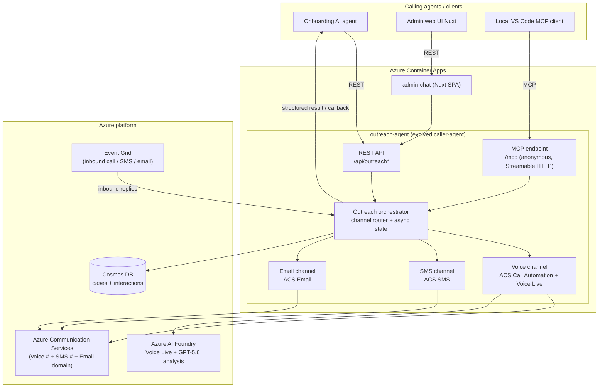

# Norlys – Multi-channel Customer Outreach Service (PoC proposal)

> Status: **PROPOSAL — for discussion before implementation.**
> This document is the "discuss the proposal first" deliverable. Nothing in the big
> build below has been implemented yet except the Phase 0 backbone noted at the end.

## 1. What the customer asked for (restated)

A service our onboarding AI agent(s) can hand customer comms over to: _reach out to a
customer on the right channel, get a response, hand the collected info back as
structured data._ It must be:

- An **evolution of the existing `caller-agent` PoC** (ACS), not a rebuild.
- Callable programmatically as a **REST API and/or an MCP server**.
- **Three channels in one unified service**: Voice, SMS, Email.
- Built on **Azure Communication Services**, reusing the existing shared components.
- Return **structured output** (customer reply + optional metrics like sentiment).
- **Async / callback** aware (voice, SMS and email don't answer instantly).
- **Portable** — buildable in our cloud now, movable to Norlys's Azure on handover.
- MCP servers hosted **in Container Apps as public anonymous HTTP endpoints**, usable by
  both the web frontend and a local VS Code MCP client. (Azure Functions MCP is
  acceptable, but see §6 for why we recommend the ACA-hosted SDK instead.)

## 2. Is it doable with an easy UI? — Yes

Short answer: **yes, and it fits the current app cleanly.** The `caller-agent` is already
an ASP.NET Core minimal-API service on Azure Container Apps with ACS, Event Grid intake,
managed identity, App Insights and SSE. We add SMS + Email + an MCP endpoint _next to_ the
existing voice endpoints — the same host, the same deploy pipeline, the same identity.

The one-line mental model:

```
caller-agent  →  outreach-agent
(voice only)     (voice + SMS + email, same service, + REST + MCP surfaces)
```

## 3. Target architecture



**Design principle: one orchestrator, three channel adapters, two front doors (REST + MCP)
that call the exact same orchestrator.** The MCP tools are thin wrappers over the REST
handlers so there is a single source of truth for behavior.

## 4. The programmatic contract

### 4.1 REST (primary surface)

| Verb & path                      | Purpose                                                         |
| -------------------------------- | --------------------------------------------------------------- |
| `POST /api/outreach`             | Start an outreach. Returns an `outreachId` immediately (async). |
| `GET /api/outreach/{id}`         | Poll status + partial/final structured result.                  |
| `POST /api/outreach/{id}/cancel` | Best-effort cancel (hang up / stop waiting for reply).          |
| `GET /api/outreach/{id}/stream`  | SSE live updates (reuses the existing SSE pattern).             |
| `GET /api/channels`              | Capability discovery (what each channel can do right now).      |

**Request (start):**

```jsonc
{
  "customer": {
    "id": "cust-123",
    "name": "Mette",
    "phone": "+45…",
    "email": "…@…",
  },
  "channel": "voice | sms | email | auto",
  "intent": "verify_address", // named playbook, or…
  "message": "Hej Mette, vi mangler…", // …a literal message/prompt
  "context": { "caseId": "…", "any": "json the caller wants echoed back" },
  "callbackUrl": "https://caller/agent/webhook", // optional push instead of poll
  "persona": "norlys-service", // reuse existing personas for voice/tone
  "locale": "da-DK",
}
```

**Response (immediate):** `{ "outreachId": "…", "status": "pending", "channel": "voice" }`

**Result (structured, on completion):**

```jsonc
{
  "outreachId": "…",
  "status": "completed | awaiting_reply | failed | no_answer",
  "channel": "voice",
  "customer": { "id": "cust-123" },
  "reply": "free-text of what the customer said/wrote",
  "collected": { "address_confirmed": true, "new_meter_no": "…" }, // intent-specific
  "metrics": { "sentiment": 4, "problem_solved": true, "frustration": 1 },
  "summary": "2–3 sentence Danish summary",
  "outcome": "resolved | callback_needed | verification_failed | escalated",
  "transcriptRef": "blob://…", // full transcript/thread, kept out of the payload
  "timestamps": { "started": "…", "completed": "…" },
}
```

The `metrics` + `summary` + `outcome` block is produced by the **structured-output
backbone already built in Phase 0** (see §10) and is _extensible_ — add a field to the
schema, it shows up here.

### 4.2 MCP (agent-native surface)

Same operations, exposed as MCP tools so any MCP client (including your local VS Code)
can drive it in natural language:

- `start_outreach(customer, channel, intent|message, context)` → `outreachId`
- `get_outreach_result(outreachId)` → structured result (above)
- `list_channels()` → capability matrix
- `cancel_outreach(outreachId)`

Hosted at `https://<outreach-agent>/mcp` — **anonymous, Streamable HTTP**, in the same
Container App. VS Code config is literally:

```jsonc
{
  "servers": {
    "norlys-outreach": { "type": "http", "url": "https://<app>/mcp" },
  },
}
```

## 5. Channels — capabilities and the honest constraints

One unified service, but the three channels do **not** have identical reach. These limits
are regulatory/technical, not effort — surfacing them now avoids a demo-day surprise.

| Channel   | Outbound                          | Inbound (capture reply)    | Reaches a Danish customer?           | Constraint                                                                                                 |
| --------- | --------------------------------- | -------------------------- | ------------------------------------ | ---------------------------------------------------------------------------------------------------------- |
| **Voice** | ✅                                | ✅ (live, in-call)         | ✅ yes, today                        | None — US toll-free calls DK fine.                                                                         |
| **SMS**   | ✅                                | ✅ via Event Grid          | ⚠️ **not to +45** from our US number | US toll-free texts **US/CA/PR only**. DK SMS needs a DK number or Messaging Connect (procurement + weeks). |
| **Email** | ✅ (free managed domain, instant) | ⚠️ needs **custom domain** | ✅ yes (email is global)             | Inbound reply capture can't run on `*.azurecomm.net`; it needs MX records on a domain we control.          |

**What this means for the demo vs. handover:**

- **Demo in our cloud (works end-to-end):** two-way **Voice** to a real Danish number,
  two-way **SMS** to a US/CA test handset, **outbound Email** globally (incl. Danish
  inbox). Inbound-email plumbing is built and wired to Event Grid but lights up only once
  a custom domain is attached.
- **Handover to Norlys Azure:** Norlys owns `norlys.dk`, so inbound email + a Danish SMS
  sender become configuration, not code. The service is built config-driven for exactly
  this (see §8).

This is the same shape of constraint we already documented for phone numbers in
`/memories/repo/acs-phone-numbers.md`.

## 6. MCP hosting decision: ACA-hosted SDK (recommended) vs Azure Functions

You said "build MCP into container apps… or Azure Function MCP if easier." We evaluated both:

|                                    | **ACA + `ModelContextProtocol.AspNetCore` (recommended)** | Azure Functions MCP extension                         |
| ---------------------------------- | --------------------------------------------------------- | ----------------------------------------------------- |
| New infra                          | **None** — same container app                             | New Function app + **Azure Queue storage** dependency |
| Language fit                       | Native ASP.NET Core, same process as our REST/ACS code    | Isolated-worker model, separate project               |
| Anonymous public endpoint          | `app.MapMcp("/mcp")`, no auth on ACA ingress              | `system.webhookAuthorizationLevel: "Anonymous"`       |
| Shares code with REST orchestrator | ✅ same DI container, one source of truth                 | ❌ cross-process call or duplicated logic             |
| Local VS Code connect              | `http://localhost:5000/mcp`                               | `http://localhost:7071/runtime/webhooks/mcp`          |
| Transport                          | Streamable HTTP (current standard)                        | Streamable HTTP / SSE                                 |

**Recommendation: host MCP inside the existing container app via the official C# MCP SDK.**
It reuses our ACS clients, managed identity, App Insights and deploy pipeline, and keeps
the MCP tools as thin wrappers over the same orchestrator the REST API uses. Functions MCP
would add a second hosting model and a storage-queue dependency for no benefit here.

## 7. Async / callback model

Non-voice channels (and even voice) complete out-of-band, so:

1. `POST /api/outreach` returns `outreachId` + `status: pending` instantly.
2. The channel adapter does its thing (dials / sends SMS / sends email).
3. Inbound replies arrive via **Event Grid** (`SMSReceived`, `InboundEmailReceived`) or, for
   voice, at end-of-call — the orchestrator correlates them back to the `outreachId`.
4. The caller gets the result either by **polling** `GET /api/outreach/{id}`, **subscribing**
   to the SSE stream, or receiving a **push** to the `callbackUrl` it supplied.

State lives in **Cosmos DB** (serverless) so it survives replica scale-out (the current app
scales to 3 replicas; in-memory correlation would lose replies today).

## 8. Portability / config-driven

Everything channel- and environment-specific is configuration, never code:

- ACS connection, phone numbers, email sender domain, Cosmos endpoint → app settings / env
  vars fed from Bicep params (the pattern already in `infra/resources.bicep`).
- Personas/prompts stay in `personas.json` (single source of truth).
- Moving to Norlys Azure = new `main.parameters.json` + their ACS resource + their domain.
  No source changes.

## 9. UI — "better UI" plan

Evolve the admin console from a **call monitor** into a **multi-channel outreach console**:

- Rename the center panel "Aktive opkald" → **"Kundesessioner"** (customer sessions across
  all channels), each row tagged with a channel icon (📞 / 💬 / ✉️ — icons, not emoji in TTS).
- A **unified outreach composer**: pick customer → pick channel (or "auto") → intent or free
  message → send. One form drives all three channels.
- A **per-customer timeline**: voice call → SMS follow-up → email, in one vertical thread,
  reading from Cosmos. This is the "see the whole conversation with a user" idea, now
  spanning channels.
- Keep the existing live transcript + sentiment panels; they become the "voice" view of a
  session.
- Norlys CVI branding rules from `.github/copilot-instructions.md` apply throughout.

## 10. Delivery plan (phased, each phase independently shippable)

| Phase            | Scope                                                                   | Infra change   | Risk                   |
| ---------------- | ----------------------------------------------------------------------- | -------------- | ---------------------- |
| **0 ✅ done**    | Structured outcome/summary/topics/follow-up draft in analysis service   | none           | none (built, compiles) |
| **1**            | Outreach orchestrator + REST (`/api/outreach*`) wrapping existing voice | none           | low                    |
| **2**            | Cosmos persistence (serverless) + correlation + async result store      | **+Cosmos**    | low                    |
| **3**            | MCP endpoint (`/mcp`) exposing the tools, anonymous                     | none           | low                    |
| **4**            | SMS channel (send + Event Grid inbound, US/CA)                          | Event Grid sub | med                    |
| **5**            | Email channel (outbound managed domain; inbound wired, needs domain)    | **+ACS Email** | med                    |
| **6**            | UI: outreach composer + cross-channel timeline + rename                 | none           | low                    |
| **7** (handover) | Custom domain email inbound + DK SMS via Messaging Connect              | procurement    | ext.                   |

## 11. Open decisions (need your steer before Phase 1)

1. **Service naming** — keep the deployable named `caller-agent` (less churn) or rename to
   `outreach-agent` (clearer story, touches Bicep/azure.yaml/Dockerfile)? _Recommendation:
   keep `caller-agent` for the PoC, brand it "Outreach" in the UI/docs._
2. **Storage** — Cosmos serverless (matches our Cosmos guidance, better template story) vs the
   already-provisioned-but-unused Table Storage? _Recommendation: Cosmos serverless._
3. **Email inbound in the demo** — do you have a custom domain we can point MX at for the
   demo, or is outbound-email-only fine for now with inbound shown as "handover-ready"?
4. **MCP auth** — fully anonymous as requested (simplest for the demo). Confirm that's OK for
   a public endpoint, or should we add a shared header key? _Recommendation: anonymous for
   PoC, note key-auth as the handover hardening step._

---

_Once you confirm §11, implementation proceeds Phase 1 → 6 in order. Phase 0 is already in
the tree (uncommitted)._
